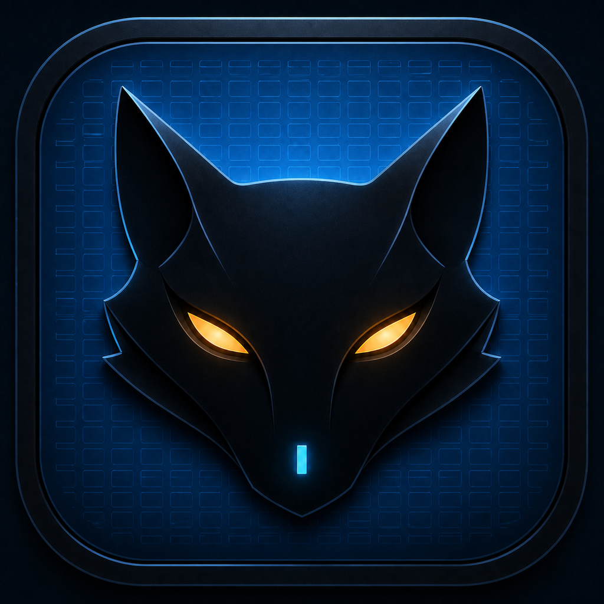

<p align="center">
  
</p>

# Grimalkin

Grimalkin is a small, native terminal emulator built with
[libghostty-vt](https://github.com/ghostty-org/ghostty),
[Odin](https://odin-lang.org/), and Vulkan. It runs on Linux, macOS, and
Windows and focuses on precise text rendering, a compact GPU draw path, and a
useful set of live visual controls.

> [!WARNING]
> Grimalkin is experimental 0.x software. It is suitable for testing and daily
> experimentation, but compatibility and configuration may still change.

[Download the latest release](https://github.com/bflyblue/grimalkin/releases/latest)
· [User guide](docs/user-guide.md)
· [Report a bug](https://github.com/bflyblue/grimalkin/issues/new/choose)

## Highlights

- Native PTY support on Unix and ConPTY support on Windows.
- Unicode shaping, programming ligatures, wide characters, colour emoji, and
  system font fallback through HarfBuzz, FreeType, and Fontconfig.
- A shared Vulkan renderer on all three platforms, using MoltenVK on macOS.
- Memory-bounded scrollback with keyboard, mouse-wheel, and high-resolution
  trackpad navigation plus a position indicator.
- Linear and rectangular selection, system clipboard integration, bracketed
  paste, and configurable OSC 52 access.
- Alt-hover (Command on macOS) to mark a URL with a dotted underline, and
  Alt-click to open it in the system browser.
- Kitty graphics: PNG and raw pixel transmission over direct, file, temporary
  file, and platform-supported shared-memory media; direct,
  Unicode-placeholder, and relative placements; scroll-region handling;
  client-selected animation frames; and the protocol's three z-index layers.
- Live settings for built-in colour themes, fonts, text rendering, cursor
  animation, padding effects, key bindings, clipboard behaviour, and window
  style.
- Optional Nerd Font symbols without requiring a patched primary font.

## Install

Prebuilt packages are attached to each
[GitHub release](https://github.com/bflyblue/grimalkin/releases). All platforms
require a Vulkan 1.2-capable GPU and a current graphics driver.

| Platform | Package | Requirements |
| --- | --- | --- |
| macOS | Signed and notarized DMG | Apple Silicon, macOS 14 or newer |
| Linux | AppImage, Debian/Ubuntu `.deb`, or Arch package | x86-64; Vulkan loader and driver |
| Windows | Installer | x64 Windows 11 24H2 or newer; [Visual C++ Redistributable](https://aka.ms/vc14/vc_redist.x64.exe) |

The Windows installer is not currently code-signed, so SmartScreen may ask you
to confirm that you want to run it. On NixOS, conventional Linux packages and
AppImages require `nix-ld`.

You can also run the Nix package directly on a supported Unix host:

```sh
nix run github:bflyblue/grimalkin
```

## First steps

Launch Grimalkin from your application menu or run `grimalkin`. On Unix it
opens your account shell as a login shell; on Windows it uses your configured
shell, falling back to `COMSPEC`.

Press `Ctrl+,` to open the live settings overlay. Changes apply immediately and
are saved automatically. Useful defaults include:

- `Shift+PageUp` / `Shift+PageDown` to move through scrollback.
- `Shift+Home` / `Shift+End` to jump to the oldest line or live output.
- `Ctrl+Shift+Up` / `Ctrl+Shift+Down` to scroll one line.
- `Ctrl+=` / `Ctrl+-` to change the font size.
- `Alt+Enter` or `F11` to enter or leave fullscreen.
- `F12` to switch between system and frameless window styles while windowed.
- `Ctrl+Insert` to copy and `Shift+Insert` to paste.

See the [user guide](docs/user-guide.md) for selection, clipboard security,
configuration locations, font overrides, and the complete shortcut behaviour.

## Current scope

Grimalkin is deliberately a focused, single-window terminal emulator. Ghostty
owns VT parsing and terminal state; Grimalkin owns the process session, display
compiler, input UI, and renderer. It advertises `TERM=xterm-256color` rather
than claiming another terminal's identity.

Kitty graphics covers direct, file, and temporary-file transmission plus shared
memory where libghostty supports it; direct and Unicode-placeholder placements;
relative placements; scroll-region behavior; deletion; queries; and z-index
layering. Animation frames and explicit frame selection are decoded and
rendered. Timed playback is not yet advanced because libghostty's public C API
does not expose the animation tick and next-frame deadline used by Ghostty's
own renderer. Please open an issue for other compatibility gaps with a minimal
reproduction and the application involved.

## Development

Linux uses the pinned native builder and Make targets:

```sh
scripts/build-linux-native.sh check test build test-gpu
./build/linux-native/work/grimalkin
```

On Apple Silicon macOS, build and verify an application bundle with:

```sh
scripts/build-macos-native.sh build/macos-native/Grimalkin.app check test build
open build/macos-native/Grimalkin.app
```

Windows uses Visual Studio, CMake/Ninja, vcpkg, Odin, and the Vulkan SDK:

```powershell
.\build-windows.ps1 -Configuration Release -Target grimalkin_ci
.\build\windows\bin\grimalkin.exe
```

If the native dependencies are already available, the Unix builders ultimately
run the ordinary `make check`, `make test`, `make build`, and `make test-gpu`
targets. `nix develop`, `nix flake check`, and `nix build` remain optional local
development and packaging conveniences; GitHub Actions uses only the native
build paths.

Before contributing, read [CONTRIBUTING.md](CONTRIBUTING.md). The
[architecture guide](docs/architecture.md) explains the PTY-to-GPU data flow
and important rendering invariants. Platform packaging and release signing are
documented separately in [docs/releasing.md](docs/releasing.md).

## Project policy

Use [GitHub Issues](https://github.com/bflyblue/grimalkin/issues) for bugs and
feature proposals. Please report vulnerabilities through the private process
in [SECURITY.md](SECURITY.md), not a public issue. Participation is covered by
the [Code of Conduct](CODE_OF_CONDUCT.md).

Grimalkin has been developed with extensive AI assistance and human review.
Contributions are judged by their correctness, provenance, tests, and
maintainability regardless of the tools used to produce them.

## License

Grimalkin is licensed under the [GNU General Public License v3.0 or later](LICENSE).
Bundled and linked dependencies use compatible licenses; see
[THIRD_PARTY_NOTICES.md](THIRD_PARTY_NOTICES.md) for the inventory.
